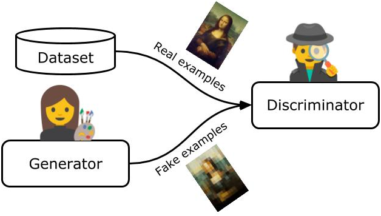
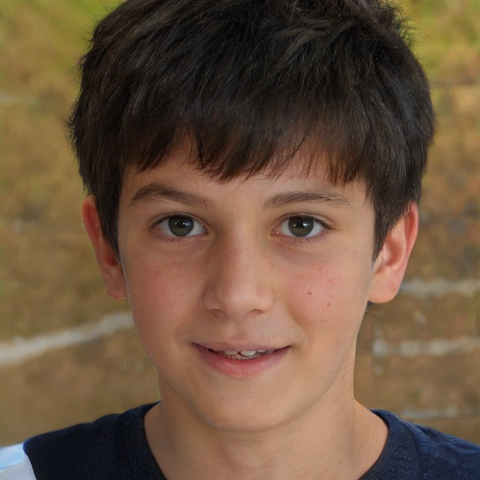
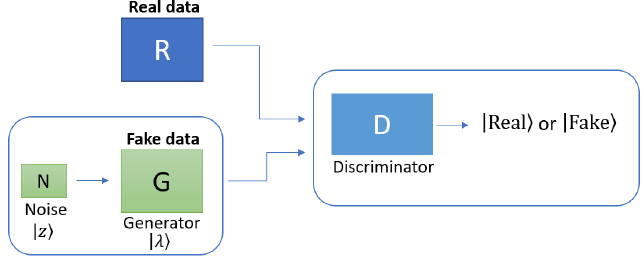
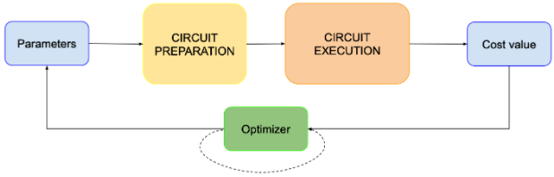
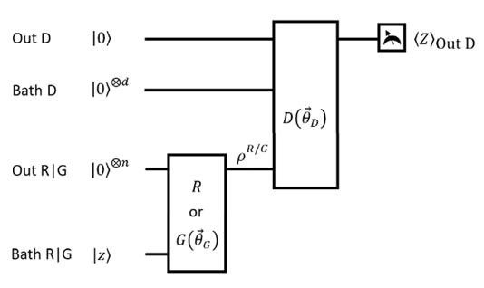
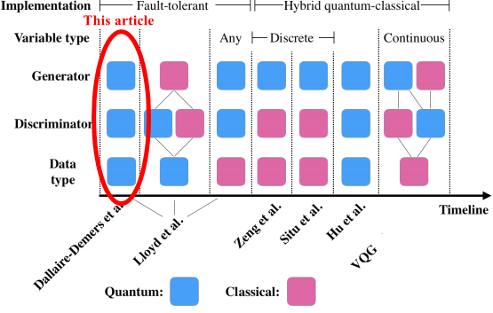
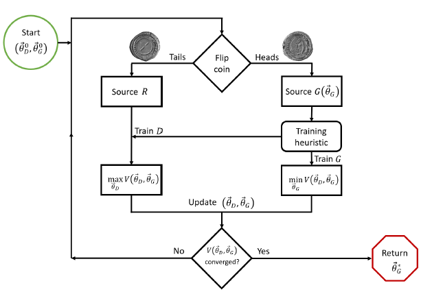
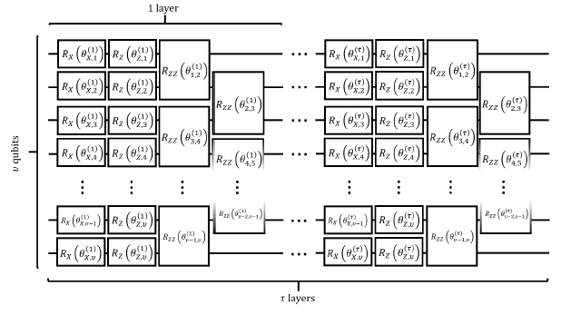

# Quantum Generative Adversarial Networks
*An accessible introduction to quantum generative adversarial networks, originally posted on medium — [article link](https://pavanjayasinha.medium.com/quantum-generative-adversarial-networks-76243d1c6888)*

CGAN, LAPGAN, DCGAN, GRAN, InfoGAN, BiGAN…

Those are all variants of generative adversarial networks (GANs)! Safe to say that GANs have taken off, with applications ranging from image generation to facial attribute manipulation. Still not convinced? Read [this](https://www.researchgate.net/publication/338050169_Applications_of_Generative_Adversarial_Networks_GANs_An_Updated_Review). It sure blew my mind. But that’s not what I’m here to talk about.

As exciting as classical GANs may be, so too is the emergence of QGANs (quantum generative adversarial networks)!

In the ensuing minutes, I share an overview of what QGANs are all about and how they work under the hood. You’ll walk away from this with an intuitive understanding of QGANs and why we care about them. Let’s start!

## What are GANs in the first place?

Before we jump into QGANs, it’s always helpful to debrief the vanilla GAN architecture. Feel free to skip around if you’re confident with GANs.

This deep-learning-based generative model uses a pair of neural networks pitted against each other — the generator and the discriminator.

### Generator

Given a real distribution of data (ex. images), the generator will generate fake data samples aiming to mimic the fixed distribution of real data. As an unsupervised network, the generator takes input a uniform random vector/variable _z_ without any clue of the real data distribution. With each step of training G (the generator), we update the weights, and it gets better at transforming this noise source _z_ into a data sample that mimics the distribution of real data.


### Discriminator

The discriminator (D) takes as input either real data samples or fake data samples (not knowing which is which), and its’ goal is to discriminate between these two classes, outputting a binary random variable.

**While the D is trying to _minimize_ the probability of misclassifying the fake data as real, G is trying to _maximize_ the discriminator’s probability of misclassifying fake data as real.**

In the ideal case, the trained generator will generate convincing data samples equivalent to the real data distribution leaving the discriminator unable to reasonably decipher between the fake and real data. At this point, **the GAN finishes training. It reaches a point called Nash equilibrium** (from game theory), at which the generator produces data that corresponds to the real probability distribution, and the discriminator guesses with a 50% accuracy.

### The fake artist & art expert



A common analogy used to explain GANs is that of the art expert and a fake artist. You can think of the generator as a fake artist trying to produce paintings that look just like the art found in the museum. The discriminator’s objective is to tell apart the generator's fake art from the real examples coming from the training dataset.

**Applied to this analogy, the discriminator assesses the paintings' authenticity while the generator tries to fool it.** The two networks are constantly trying to outwit each other in this zero-sum game. The better our artist (generator) gets at creating convincing data, the better our art expert (discriminator) needs to distinguish real examples from fake ones.

Want to fool your own discriminator? Check out this [website](https://thispersondoesnotexist.com/) to view realistic-looking human faces produced entirely through GANs.



[This person does not exist](https://thispersondoesnotexist.com/).

## QGANs

Source: [Dallaire-Demers et al. (2018)](https://arxiv.org/abs/1804.08641)

**Alright, let’s talk about QGANs**, the quantum version of generative adversarial networks. They share many similarities with the classical analogue, so don’t be intimidated by the word “quantum.” I’ll try my best to avoid as much jargon as possible, but I’d generally recommend having some familiarity with variational quantum algorithms (VQAs).

### An aside on variational quantum algorithms

Despite the deceiving name, a QGAN is not a fully quantum algorithm. In fact, **all near-term quantum machine learning algorithms are hybrid quantum-classical algorithms** containing both classical parts and quantum parts.



[Variational Quantum Algorithms — How do they work?](https://www.mustythoughts.com/VQAs-how-do-they-work.html)

They’re called variational quantum algorithms because these parameterized quantum circuits run iteratively, optimizing parameters along the way, hence the name “variational.”

By the way, “parameters” in quantum lingo == “weights” from classical machine learning. So why don’t we call them weights? With the case of a parameterized quantum circuit, these “weights” are parameters passed into specific quantum gates within the circuit instead of the classical case with neuron weights.

Ideally, the quantum computer is used to run a short but classically inefficient step in the workflow. To train the circuit, it’s surprisingly similar to any other classical neural network!

Plugging the outputted cost value into a classical optimizer, we arrive at ‘better’ parameters which we feed back into the quantum circuit. This loop runs iteratively until our quantum circuit has converged. So that’s VQAs in a nutshell. But how does this apply to QGANs?

### Here’s the gist

Let’s equip you with a high-level overview of what’s going on before jumping into the technicalities.



The general structure of QGANs. The real source R or the parametrized generator G(theta\_G) is applied on an initial state |**0**⟩, and each outputs a mixed or pure quantum state described by a density matrix. The discriminator is denoted as D(theta\_D). We will discuss details on each register later.

A QGAN uses two parameterized quantum circuits, the discriminator and the generator. The wonderful part about GANs, which carries to QGANs, is that we use the discriminator’s training signal to train the generator!

Our two quantum circuits maximize and minimize the same optimization problem in this zero-sum game, which we’ll formalize in a few minutes.

After many _many_ training steps, the generator learns the optimal parameters to pass into its quantum gates. It spits out a quantum state that is approximately equivalent to the quantum state representing real data.

The gist? The generator learns the real quantum data solely through the discriminator’s training signal.

> But how does it do that?

First, the discriminator tries to improve _its_ strategy, while the generator’s strategy stays fixed. Then they switch turns, and the generator tries to improve _its_ strategy, with the discriminator’s strategy fixed. These two players keep updating for hundreds if not thousands of epochs until the fixed point is reached. We call this point the unique Nash equilibrium, just like classical GANs.

So now you might be wondering, what does this fixed point look like? And there, we see another key similarity between classical GANs and our quantum version.

**The QGAN has finished training once the trained discriminator cannot reasonably distinguish between generated/real quantum states (correct classification probability at 50%)**. In that case, the quantum states (technically density matrices) of both the generator and the real data distribution are approximately equivalent.

That’s basically it! Although there are prominent differences when you peer under the hood — which we will surely not forget — generally, the quantum version of GANs lines up with what you would expect.

**A quick note before we jump into the fun stuff**

QGANs actually come in several degrees of “quantumness.” In the interest of brevity, we will carry on to explain QGANs that are based upon quantum data/generator/discriminator. Although there can be a mixture of all those parts being either classical or quantum, the principles that underly a solely quantum QGAN are inclusive to other variations.



Timeline of the development of quantum generative adversarial network models ([source](https://arxiv.org/abs/1901.00848)). The implementation we’ll be covering (circled in red) was first proposed by Dallaire-Demers et al. ([source](https://arxiv.org/abs/1804.08641)), and several concepts in this article are drawn from that original paper.

## Let’s dive a bit deeper.

Now that you have a high-level intuition about how a QGAN works, let’s solidify it, starting with the generator.

### On the discriminator

The discriminator takes as input both data sources (R and G) but is clueless about whether it’s been given a real data sample or a fake one. After running the quantum circuit, it **outputs a single binary decision variable that could mean ‘1’ for real and ‘-1’ for fake**. Recall the analogy of the fake artist and the art expert.

To evaluate the art expert's effectiveness, we can’t judge him too harshly on just one run. Maybe he was just unlucky… We must understand how he performs as a whole.

To do that, we’ll need to run the discriminator on many data samples from both the generated data distribution _G_ and the real data distribution _R._ From there, we average out his results.

And what do we get? The expectation values.

> What’s an expectation value?

In our case, the expectation value is just the average output of the discriminator. Since we’ve hooked up the discriminator to both generated data _and_ real data (in practice, these are two separate circuits), we’ll have two expectation values on how it performed on both data sources.

So let’s say our real data circuit (DR) and generated data circuit’s (DG) measurements are the following, respectively.

DR = \[ 1, 1, -1,1\]

DG = \[-1,-1,-1,1\]

_There would, of course, be several hundred if not thousands of more measurements, but I’ve truncated it for convenience._

Here, the real data circuit's expectation value along the Z basis is 0.5 (=1+1–1+1 /4), meaning that there’s a 75% probability that the discriminator classifies real data as real.

Following that logic, the expectation value of DG is -0.5, meaning that there’s a 75% chance that the discriminator classifies generated data samples as fake. Not bad!

Note that both of these expectation values are derived from one instance of the discriminator. Given these expectation values, we can now classically optimize its’ parameters using the cost function.

> But how?

I promise we’ll discuss the actual cost function, but until we do, I encourage you to try and construct a cost function that works in the environment we’ve just discussed! You now know enough to do so.

> Wait, what’s the Z basis and how did you arrive at the probability?

Unless you want to look deeper into quantum computing, I’m afraid you will have to accept the following explanation. In QC, we can measure along different bases, and one of the most common measurements is done along the computational basis (in other words, the Z basis).

Measuring is inherently the act of sampling the eigenvalues of the basis you’re measuring in. Since the Z basis's eigenvalues are -1 and 1, we arbitrarily define ‘real’ as ‘1’ and ‘fake’ as ‘-1’.

From there, to arrive at the probability, we classically post-process the data to transform the measurement range \[-1,1\] to our probability range \[0,1\]. It turns out that adding 1 to all samples of that set and dividing by 2 takes us to \[0,1\].

### The cost function — for the mathematically motivated

Now that we have these expectation values, what do we do with them? Well, we need to construct a cost function for our classical optimizer to optimize over. In the next few minutes, I’ll be guiding you through arriving at our final cost function. Still, I must preface that some basic prerequisite linear algebra and quantum computing fundamentals are needed.

Okay, so let’s get started.

To measure the discriminator’s cost, we start with the following high-level cost function. Minimizing this entails maximizing the probability of correctly classifying real data while minimizing the probability of mistakenly classifying fake data.


Eq 1

As a hallmark of GANs, the generator’s cost function will simply be the negation of the discriminator’s cost, where the optimal strategy is to maximize the probability of the discriminator misclassifying fake data.


Eq 2

We can formalize the two cost functions above into one adversarial optimization problem for the QGAN


Quantum adversarial learning strategy — Eq 3

where θ\_D is the vector of parameters we plug into our discriminator ansatz, θ\_G is the vector of parameters we plug into our generator ansatz. Z  is the random noise variable inputted into the generator (we will touch on this in a few minutes).

If you understand eq 1&2, you completely understand eq 3 since it’s simply an amalgamation of the two into a convex optimization problem!

Note that similar to the classical GANs, both parts depend on θ\_D, but only the second depends on θ\_G. This means that we can simplify the minimization of this problem concerning θ\_G only to contain that term that depends on it. Thus, we simplify Eq 2 to the following


The simplified cost function for the generator

Let’s take a step back here and look at the analogue with classical GANs.


Classical adversarial learning strategy — log-likelihood functions

The optimization task is composed of many log-likelihood functions. I won’t go into all of the variables, but the important thing to note here is that optimizing the F\_D neural network entails maximizing the log-likelihood sum of the correct classifications concerning its weights. The inverse applies for F\_G.

However, in the quantum case, we use a linear cost function in the output probabilities of D since we want to optimize a linear function in some expectation value.

But the expectation value of what? To refine our cost function, we need to include an operator with which we can take the expectation value of the out D register. It turns out that the Pauli Z operator is a great fit for this since it upholds the orthogonality of |real⟩ and |fake⟩ with the computational basis set {0,1} and eigenvalue set {1,-1}.


The general form of Z operator

We want to condition the QGAN such that |real⟩ and |fake⟩ are orthogonal to retain the distinguishability of the two for training D, resulting in a better G.

We arbitrarily define |real⟩ as |0⟩and |fake⟩ as |1⟩ thus inheriting +1 and -1 eigenvalues, respectively.

```
Z = |0⟩⟨0| - |1⟩⟨1|  # when we label |real⟩ as |0⟩ and |fake⟩ as |1⟩ 〈real|Z|real〉= 1  # Expvals of statevectors with respect to Z are  
〈fake|Z|fake〉= −1   proportional to the correct classification
```

Given the above, we conclude that **the expectation value of Z on the D output will be proportional to Pr(real|real)** (the probability that real data is classified as real).

Having established that, let’s move forwards to define the nature of the quantum states we’re actually taking the expectation values of.

Referring back to the circuit schematic,


The real source R or G(θ\_G) is applied on the initial state |0,_z_⟩ respectively defined on the Out R|G and Bath R|G registers. The discriminator uses the outputted state from the source and an initial state |0,0⟩ defined on the Out D, and Bath D registers to output its’ answer |real⟩ or |fake⟩ in the Out D register. Bath D and Bath R|G are workspaces for the discriminator and generator, respectively.

we see that the first operation applied is the R or G(θ\_G) (depending on the chosen data source) acting on qubits _n+m_ in the initial state |0,z⟩ (the `Bath R|G` register consists of _m_ qubits).

Assuming that R is a purified unitary operation that acts on both the `Out R|G` and `Bath R|G` registers, these unitary operations corresponding to the sources R and G(θ\_G) acting on the whole quantum computer can be defined as


where we’re applying a scaled identity on the `Out D` and `Bath D` registers, to denote the fact that we operate nothing there.

After the source has been applied, the quantum computer is in the following state.


We use a density matrix to represent the state to maintain the generality of both pure and mixed states.

Following the circuit schematic, we then apply the discriminator, which we can define using the following unitary operation


in which _m_ denotes the number of qubits in `Bath R|G`. Now, we can define the state of the quantum computer when U\_D follows U\_R as


and the state when U\_D is applied after U\_G as


_If you’re wondering why we evolve a density matrix by sandwiching it between the unitary and its transpose, then check this_ [_wiki_](https://en.wikipedia.org/wiki/Density_matrix) _out to understand the difference between evolving a pure state and a density matrix._

Now that we understand the previous terms and definitions, we can redefine the formal cost function from Eq 3 in the quantum formalism as


Eq 4 — **recall that the expectation value of a density matrix with respect to an observable Z is the trace of that Z operator applied to the density matrix**. Read [here](https://en.wikipedia.org/wiki/Density_matrix#Measurement) to learn more

where we’ve represented the probabilities through expectation values. Here, Φ denotes the bias of the source we use since the probability that R or G is used as a source was not explicitly constrained in Eq 3.

For example, if we feed the discriminator more of R than G, D will learn to merely guess R more often instead of learning the real data distribution. Assuming a balanced random choice of R or G (Φ =π/4 → sin²/cos²(π/4) = 1/2), the quantum optimization problem has the final form


The final quantum optimization problem for QGANs

Being an optimization problem, scaling factors and constants are superfluous. Thus, we’ve excluded them from the optimization problem above.

**Confused?** **Click** [**here**](https://www.notion.so/pavanjay/Deriving-the-quantum-optimization-problem-for-QGANs-64d073e28c5b488186a5d7c036eada04) **for a complete derivation.**

Not confused? Great! You now understand the linear cost function under the hood of QGANs and how it’s different from the log-likelihood cost of classical GANs. All that is left to do is classically optimize this cost function for a sufficient number of epochs.

### Now what? Update rule

Using the final cost function V(θ\_D, θ\_G), we can use classical gradient descent to arrive at the optimal parameters. Depending on the specific training step _k_, the update rule for the parameters D(θ^k \_D ) or G( θ^k \_G ) is given by


Where Χ^k \_D and Χ^k \_G are learning rates.

For those unfamiliar with gradient descent, think of it as a function that moves our input parameters such that we incur the steepest descent of our cost function.

### Convergence!

With sufficient training steps of G, the statistics produced by G become approximately equivalent to the real data source! At this point, we’ve converged, leaving D unable to differentiate between R and G, as the probability of successful classification reaches its equilibrium value of 1/2 (meaning that D is basically guessing).

Mathematically speaking, we can say that the cross-entropy between the real and generated data


The cross-entropy between R and G

converges to 0. At this point, the adversarial game has reached Nash equilibrium, and we finish training given that D cannot improve its strategy and all gradients vanish:


### The algorithmic flow

Look at the flowchart below. You understand all of it now! Isn’t that crazy? In just minutes, you learned the algorithmic flow of a QGAN, backed by mathematical understanding.

Just to solidify it, let’s do a quick recap:

1.  We start by initializing our parameter vectors for G and D arbitrarily
2.  With a fixed θ\_G, we evaluate the cost for D and update parameters accordingly for a sufficient number of steps to maximize V(θ\_D, θ\_G)
3.  Then fixing θ\_D, we evaluate the cost for G and update its’ parameters to minimize V(θ\_D, θ\_G)
4.  We then repeat steps 2&3 until we have converged at a point when all gradients vanish, and the discriminator’s best strategy becomes to guess with an accuracy of 50%.
5.  Return the optimal parameter vector for G



The algorithmic flow of a QGAN, source: [Dallaire-Demers et al. (2018)](https://arxiv.org/abs/1804.08641)

Equipped with the theory, you’re ready to go and start building your own QGAN! But before you do, I’ll share some practical tips I missed in the theory that will help you along your way.

### Some thoughts to keep in mind

**Evaluating the D and G cost on quantum circuits**

If you look back at our cost function from beforehand, you’ll see that two terms depend on θ\_D in the cost function. This makes sense since each term is a measure of the discriminator’s efficacy on each data source. But what this means in practice is that you must double the number of circuit evaluations when calculating the discriminator’s cost compared to the generator’s cost.

_Recall that the DR expectation value is for the quantum circuit where R is fed into D, and the DG expectation value is for when G is fed into D. D wants to maximize the DR expval while minimizing the DG expval._

The generator has only to run the DG circuit to arrive at its expectation value to optimize θ\_G. But for the discriminator’s cost function, it needs to evaluate both expectation values, meaning that it will run the DR circuit _and_ the DG circuit.


The final quantum optimization problem for QGANs


Simplified individual cost functions for D and G

As an additional reminder, when you’re training D, you will fix θ\_G (the generator) so that you can improve the cost function solely for θ\_D. Inversely, when you’re training G, you will keep θ\_D fixed as you optimize G’s cost function solely for θ\_G.

### The D and G training tradeoff

A common problem with classical GANs that carries over with QGANs is the training tradeoff between the generator and discriminator. Let me explain.

**We update the discriminator much more often than the generator**, but why is this? Well, because of their cost functions' interdependency, without a reliable training signal from D, G would be left clueless. Although the precise ratio of training D over G is determined heuristically, it‘s not uncommon to see the generator G being updated only once every 100 steps of _D_.

**The tradeoff is between having a reliable signal quality to train the generator and actually training the generator.** The more steps taken in training the generator, the fewer epochs improving the discriminator signal quality, which you need to train it well.

So when building your QGAN, keep in mind that updating the generator less often than the discriminator provides a trade-off between D's rapid training and a reliable training signal for G.

### Thinking on G and |z⟩

Think of the quantum generator as transforming an unstructured latent input space into a generated sample space. What this means in practice is that we input a random variable to the generator, which it then maps to a sample in the _k-_dimensional generated probability distribution. The whole act of training G is for it to get better at transforming this random variable |z⟩ to something matching R. One detail that I’ve excluded thus far is this random vector/variable, so let’s talk about it.

Like classical GANs, quantum generators take as input an unstructured random variable that acts as a noise source. At first, this seems unmotivated, but in reality, it’s crucial to the robustness of the QGAN.

Adding a source of unstructured noise adds entropy to the generated probability distribution. The role of this is two-fold.

If the real distribution has non-zero entropy, then our generator will also have to match that. By allowing the |_z_⟩ to fluctuate, we can train the generator to match or exceed the entropy of the real distribution.

Two, the |_z_⟩  variable can serve as an indirect control for the generator as well.

Tuning |_z_⟩ leads to a transformation of the generated output states. During training, if our ansatz is non-universal, the generator should learn to capture the most important intra-parameter factors of variation with _z_.

> Confusion.

Let’s break that down. |_z_⟩ is a constant source of unstructured noise, which has an appreciable effect on the generated output state. Hmmm, if that’s the case, we can adjust our generator to learn |_z_⟩ to encode certain intra-parameter properties. But that’s all under one condition.

In the case of a fully universal ansatz, this would be futile since configurations of the ansatz parameters themselves allow the ansatz to encompass the landscape of all possible quantum states.

However, when we aren’t dealing with a universal ansatz, we can use |_z_⟩ to capture the most important intra-parameter factors.

So why is |_z_⟩ cool? It’s cool because it allows us to mimic the real data's entropy while enabling our GAN to use that very randomness of |_z_⟩ to encode intra-parameter factors.

Once more, though not formally proven, we could hypothesize that like classical GANs, |_z_⟩, as a noise variable, prevents the discriminator from overfitting.

### Beware: classical data encoding

Although the variation of QGANs we discuss here deals with quantum data, I want to address a non-trivial assumption regarding the real data circuit when exploring outside the quantum data domain.

We encode the real distribution of data (_r_) into our qubits. In practice, this means hard-coding a series of Pauli operators on a satisfactory number of qubits such that no data loss occurs.

Although this may seem easy at first glance, encoding real-world data — often classical — into quantum circuits poses a potential bottleneck for quantum machine learning. As an active research area, I’ll defer exploring this in detail until later, but I’ll give you a taste into why it matters.

Engineering an efficient method to encode real-world data into a quantum circuit is crucial if we want to achieve practical quantum advantage. We could have an exponentially faster algorithm, but if classical data encoding is highly inefficient, our whole algorithm could be rendered useless! _Read this_ [_paper_](https://arxiv.org/abs/2008.08605) _to learn more._

On the other hand, encoding classical data in a smart way to maximize potential quantum advantage is also non-trivial. Quantum computers are best at computing correlated states like what’s found at the subatomic level. But unfortunately, real-world problems usually don’t coincide into correlated states where quantum computers dominate. So searching for instances where that _is_ the case remains a large part of quantum machine learning research. _Read this_ [_paper_](https://www.nature.com/articles/s41534-019-0223-2) _to learn more._

### An ansatz suggestion

Until now, I purposely avoided touching on potential ansatzes since ansatz choice varies considerably dependant on your use case.

With that said, let’s expose you to some potential ansatzes that you can test out when building your own QGAN. Apart from the universal ansatz proposed in the QGAN paper, I’ve linked the others down below; feel free to look through them.

In [the paper](https://journals.aps.org/pra/abstract/10.1103/PhysRevA.98.012324) that inspired this article, Dallaire-Demers et al. propose a universal ansatz used to parameterize D or G.



_A practical universal circuit ansatz for either G or D. Each layer is composed of parameterized single-qubit X rotations followed by parameterized Z rotations. A layer of staggered sets of parameterized nearest-neighbour ZZ rotations follows the single-qubit rotations._

*   [Circuit-centric quantum classifiers](https://arxiv.org/abs/1804.00633)
*   [Low-depth circuit ansatz for preparing correlated fermionic states on a quantum computer](https://arxiv.org/abs/1801.01053)
*   [Hardware-efficient variational quantum eigensolver for small molecules and quantum magnets](https://www.nature.com/articles/nature23879)
*   [Quantum-optimal-control-inspired ansatz for variational quantum algorithms](https://arxiv.org/abs/2008.01098)
*   [Exploring Entanglement and Optimization within the Hamiltonian Variational Ansatz](https://journals.aps.org/prxquantum/abstract/10.1103/PRXQuantum.1.020319)

## Why quantum?

Apart from QGANs simply being cool, after all this, I feel I should probably address the motivation behind quantizing GANs. Why do researchers believe there to be a potential speedup over classical GANs? Let me explain.

In quantum chemistry, quantum computers have an intrinsic exponential advantage in being able to represent molecules. Why? Because the Church-Turing hypothesis doesn’t seem to uphold for very correlated distributions like correlated fermionic states. Put simply, classical computers are exponentially slower in simulating correlated distributions (i.e. molecules).

QGANs have the potential for an exponential speedup in sampling and manipulating these probability distributions that are classically intractable (exponentially difficult to sample from classically).

As long as we use an ansatz that can represent these correlated distributions, QGANs could potentially be used to generate new types of molecules that fit the mould of an inputted set of materials/molecules possibly obtained through VQE.

Apart from correlated states of matter, QGANs pose a potential advantage with the implementation of efficient metrology. So far, we covered the surface level method in obtaining expectation values that depend on ensemble averaging. Still, there are other methods to estimate quantities with less sampling—namely, [phase estimation](https://journals.aps.org/pra/abstract/10.1103/PhysRevA.75.012328), [amplitude estimation](https://arxiv.org/pdf/2006.09350.pdf), and even [Bayesian inference](https://arxiv.org/pdf/2006.09350.pdf). Although not directly related to QGANs, let me briefly outline what each entails.

As one of the original alternatives to ensemble averaging, phase estimation offers the opportunity to asymptotically accelerate the conventional measurement process to a sample complexity of O(log(1/ε)). As appealing as this is, there presents a tradeoff between sample complexity and quantum coherence with this approach.

Closely related to phase estimation is amplitude estimation, which also guarantees many of the prior performance speedups. Simply put, phase estimation is essentially equivalent to estimating the expectation value of ⟨A|P|A⟩ where |A⟩ is an ansatz state and P being a reflection operator defined as 2 times a projector minus the identity. Amplitude estimation was then further reformulated as phase estimation on a certain Grover’s iterate U, where the desired amplitude information is encoded in the eigenvalues of U.

Touching Bayesian inference, parameter estimation problems are widespread in statistical inference, and we can also see expectation value estimation through that lens. _Stretching my knowledge boundary, so be suspect._ When looking through the perspective of Bayesian inference, from what I understand, the gist is first to treat the operator expectation value as a parameter to be estimated. Then, we construct a parametrized quantum circuit. After that, we execute the circuit and collect measurement outcomes which we use to sample a new _hybrid_ likelihood function. Given a prior distribution on our expectation value, Bayesian inference uses a measurement outcome of the parameterized circuit to produce (or update the prior to) a posterior distribution.

I think you’d agree that that’s enough metrology for now. Let’s touch on a few general quantum computational advantages that manifest themselves in the domain of QGANs.

As put so eloquently by Lloyd et al. in [Quantum Generative Adversarial Learning](https://arxiv.org/abs/1804.09139):

> The ability of quantum information processors to represent vectors in N-dimensional spaces using log_N_ qubits, and to perform manipulations of sparse and low-rank matrices in time _O(poly(log_N_))_ implies that QGANs exhibit a potential exponential advantage over classical GANs when the object of the game is to reproduce the statistics of measurements made on very high-dimensional data sets.

In other words, QGANs have a potential exponential speedup when generating data made on very high-dimensional data sets.

For example, performing gradient descent in a set of normalized covariance matrices takes time O(_N_²) for a classical generator. If _N_ is large, like _N_ \= 10¹², then performing this convex optimization will take 10²⁴ steps! But a quantum generator enables us to represent covariance matrices using O(log_N_) qubits and manipulate the covariance matrices represented through those qubits in O(poly(log_N_)) operations.

## Wrapping it up

Okay, I must admit that was a lot. Let’s recap:

*   A QGAN uses two parameterized quantum circuits, the discriminator and the generator. The generator learns the optimal parameters to transform a random latent input space into a _k_\-dimensional generated probability distribution space to ensure the greatest intersection with the real probability distribution. Inversely, the discriminator optimizes against this to uphold the cross-entropy between the two data distributions.
*   The classical log-likelihood cost function's reformulation into our quantum formalism as a linear convex optimization problem (which we derived from scratch) ensures a reliable gradient descent.
*   The QGAN has finished training once the trained discriminator cannot distinguish between generated/real quantum states with probability >1/2. At this point, all gradients vanish, and the cross-entropy between the real and generated density matrices is 0.
*   The unique fixed point is called the Nash equilibrium when the generator produces data equivalent to the real data. The QGAN will always converge to this point.
*   QGANs have the potential for an exponential speedup in sampling, manipulating, and reproducing probability distributions that are classically intractable (e.g. correlated fermionic states)

**If you enjoyed the article or learned something new, feel free to reach me at** [**pavanjay.com**](https://pavanjay.com/) **or** [**see what I’m up to**](https://www.subscribepage.com/pavanjaynews) **in my monthly newsletter.**

_So grateful to Pierre-Luc for helping me out with all my questions as I navigated this tricky subject! I wouldn’t have learned this within the time frame that I did without your paper and patience!_

## Resources

Want to see a QGAN built? Look through this [pennylane tutorial](https://pennylane.ai/qml/demos/tutorial_QGAN.html). Having understood what we’ve discussed here, you will breeze through it with a newfound appreciation for the simplicity of QGANs.

The three papers that set this post into motion: [Dallaire-Demers and Killoran (2018)](https://arxiv.org/abs/1804.08641), [Lloyd and Weedbrook (2018)](https://arxiv.org/abs/1804.09139), [Zoufal et al. (2019)](https://arxiv.org/abs/1904.00043)

Want to see QGANs applied to portfolio analysis? Check out the article I co-authored with my teammates at QHack 2021: [Using QGANs for portfolio analysis](https://calumholker.medium.com/using-quantum-generative-adversarial-networks-for-portfolio-analysis-f8c56ac68fd2).

<hr>
Pavan Jayasinha
