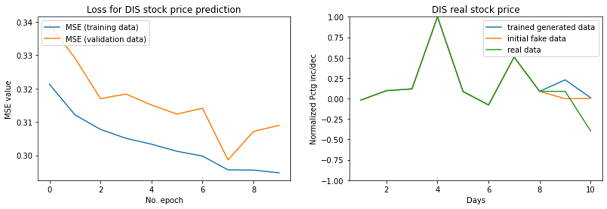
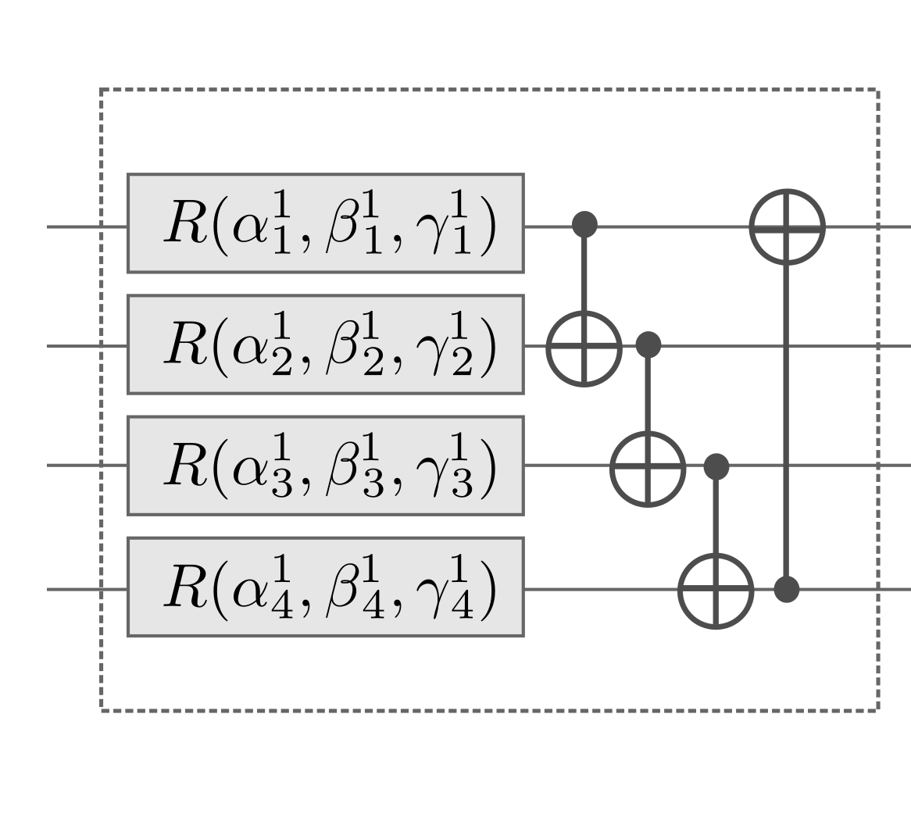

## Naive approach with simple parameterized quantum circuits
Before applying quantum generative adversarial networks to this learning task, we first explored the capacity of conventional variational circuits to learn these stock price sequences in a completely supervised setting. Here, we share the notebooks used to create the variational circuits. 

### A simple quantum neural network to learn DIS stock prices
Due to hardware and time constraints, I chose to reduce the dimensions of the dataset from 19 to 12, with 8 days now being fed as input to predict the following four days. To that end, we created a 12 qubit parameterized quantum circuit that was trained to predict the next 4 days of `$DIS` stock price data (as expectation values) after taking the prior 8 days as input. 

We defaulted to using amplitude embedding to encode the 8 days of data onto the first 8 qubits. 

To imitate classical GANs, we fed Gaussian noise as input through the last four qubits by initializing paramaeters of an arbitary unitary rotation to a normal distribution.

**Conclusion**: We conclude that given 10 passes through the whole dataset, the quantum neural network was not able to generalize to predict the next iterations of stock price data. Although the slowly reducing training loss signals to us that the QNN is able to pick up certain patterns, there exists no evidence that it has been able to generalize well. Stated again, this was to be expected given the magnitude of difficulty in predicting stock prices. However, we will evaluate the performance of the QGAN on this task to compare if it generalizes better.

### A simple qnn to evaluate capacity of ansatzes
Since the QNN isn't able to generalize to all data samples, we then posed the question: "how many datapoints can the parameterized quantum circuit learn?" Which sparked us to investigate the relationship between certain ansatz structures and the learnability of the QNN over _n_ data samples. Our records have been added to `root/hyperparameter_training_log.md`.

**Conclusion**: Given time constraints and the exponential time consumption of the training, we were unable to evaluate the upper bound of the QNN. However, we conclude that QNN was able to learn three distinct sequences of price data given the Gaussian latent space. The above image shows one ansatz structure we used from [Pennylane](https://pennylane.ai/) which we layered thrice, it has strong entanglement.
